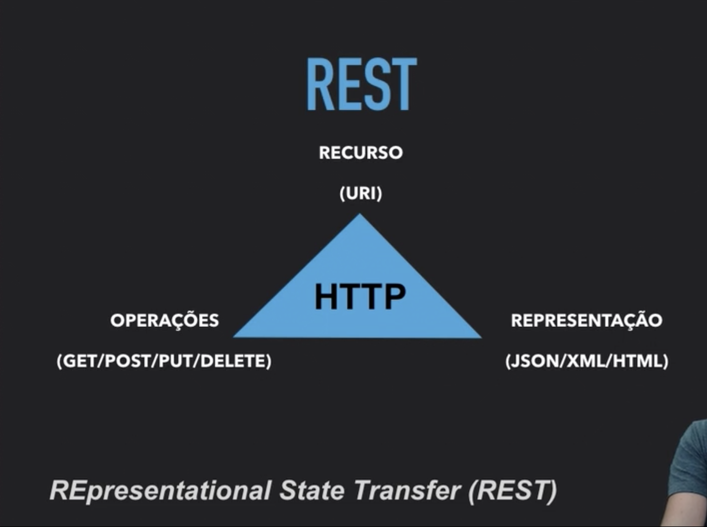
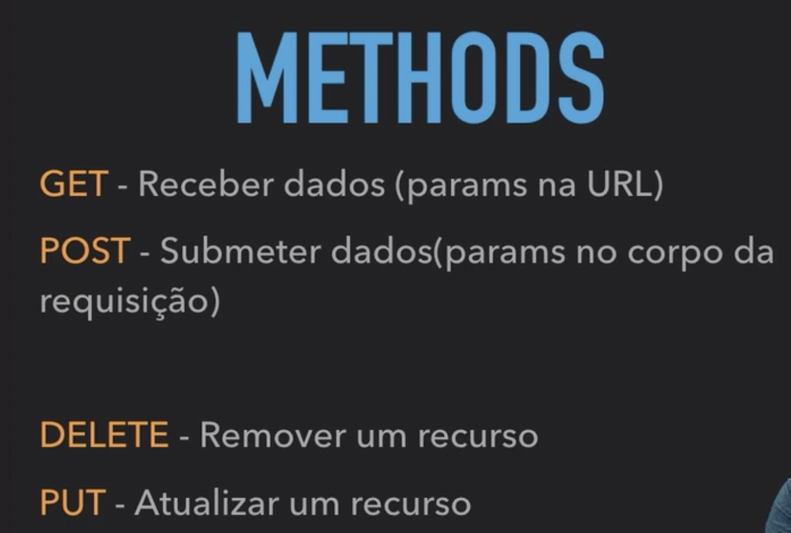
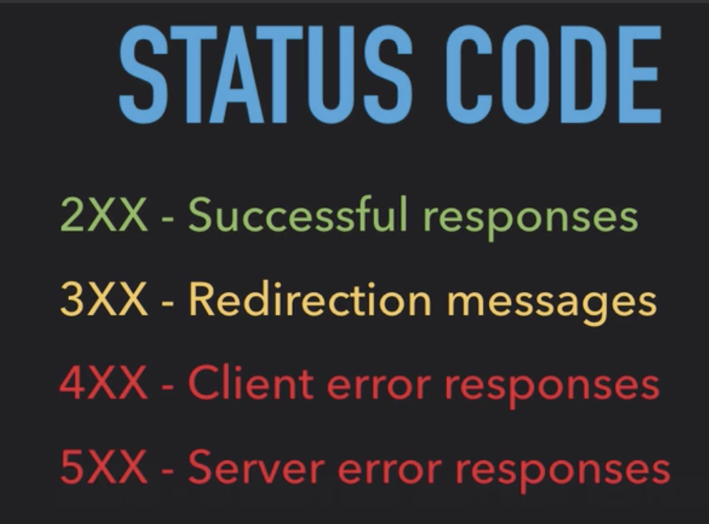

### O que é o HTTP?

O http é um protocolo de comunicação. Um conjunto de regras que define a comunicação entre cliente e servidor na web.

### HTTPS

O HTTP (Hiper Text Transfer Protocol) tráfega apenas texto puro, o que pode ser perigoso: os dados podem ser descobertos e vistos por terceiros mal intencionados. Pensando nisso foi criado o HTTPS, que adiciona uma cama de segurança SSL / TLS (Secure Layer Transport / Transport Layer Security)

#### Funcionamento HTTPS

Para garantir a segurança na web é necessário existir uma identidade. Essa identidade é dada através de um certificado digital, utilizado a partir de uma chave pública e uma chave privada.  
O cliente envia os dados para o servidor de forma criptografada através de uma chave pública. O servidor por sua vez é o único que consegue descriptografar a mensagem, utilizando uma chave privada. 

### Modelo requisição - resposta

O HTTP é stateless, ou seja, ele não guarda estado, cada requisição é única e não sabe o que foi feita na requisição anterior.  
Mas então, como manter as informações do usúario?
O servidor manda uma identificação para o navegador para saber que o usúario já é ativo, assim o navegador sempre manda essa identidade a cada nova requisição. Esse é o conceito de sessão (também descrita como o tempo que o usuário ficará logado no servidor). Sempre que precisamos guardar informação fazemos isso através de uma sessão.  
A sessão é implementada usando a ideia de cookies, que basicamente é um par de chave e valor.  
Em resumo temos:

- Uma requisição precisa conter todas as informações para o servidor gerar a resposta.
- Stateless significa que o HTTP não mantém informações entre as sessões.

### O que são cookies?

Um cookie é um pequeno arquivo de texto, normalmente criado pela aplicação web, para guardar algumas informação sobre usuário no navegador.  
Um cookie pode ser manipulado e até apagado pelo navegador e, quando for salvo no navegador, fica associado com um domínio.

### O que é REST?

REST: Representational State Transfer  
Rest é um padrão arquitetural para comunicação entre aplicações. Ele aproveita a estrutura que o HTTP proporciona.
Além disso, temos alguns pontos:

- Os recursos são definidos na URI
- Operações são definidas com os métodos HTTP (GET, POST, PUT, DELETE)
- Cabeçalhos são usados também para especificar a representação dos dados que serão recebidos (Accept/Content-Type)

### Métodos HTTP

### Familias de Status Code

### HTTP 2

O HTTP 2 é a nova versão do HTTP. Nessa versão tempos algumas alterações no protocolo.

- O corpo da resposta foi comprimido através do algoritmo GZIP. Isso é feito para diminuir o tamanho dos dados enviados. Isso é bom para dispositivos com uma largura de banda menor (como smartphones)
- O HTTP não envia mais texto puro, mas sim texto binário. O texto sai da requisição como binário. O response também vem como binário.
- Existe ainda uma outra compressão através do algoritmo HPACK, para comprimir o cabeçalho
- O HTTP 2 por padrão já criptografa os dados através do TLS
- No HTTP2 não precisamos enviar os HEADERS passados em requisições anteriores (se a próxima requisição tiver os mesmos cabeçalhos). Em caso de alteração no cabeçalho, enviamos apenas os cabeçalhos atualizados. Isso se chama HEADERS STATEFUL. Essas informações são guardadas através do HPACK.
- No HTTP 2 não temos mais as chamadas requisições seriais. O servidor já manda todos os recursos que o cliente precisa para renderizar o HTML. Isso se chama Server Push (o servidor envia dados sem a necessidade do cliente pedir).
- No HTTP 1 cada nova requisição abre uma nova conexão. Nesse contexto, existe o Keep Alive, que diz quantas conexões TCP estarão ativas em uma comunicação. No HTTP 2 podemos fazer requisições assíncronas: mandamos requisições sem esperar as respostas das anteriores. Isso se chama Multiplexing.